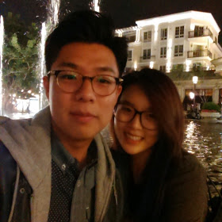

# About me
## Samuel Lee
---


---
My name is ***Samuel Lee*** and I am from **Diamond Bar, CA**.
Test Test
---

### Here are a few more things about me

1. I graduated from Pepperdine University
2. I am 26 years old
3. During this program, I am staying at my friends house


### Favorite websites

* [Reddit](http://www.reddit.com)
* [Quora](http://www.quora.com)
* [BuzzFeed](http://www.buzzfeed.com)

In my previous job, I made some *very minor* changes on html (changing fonts, colors, text, etc.) and it caught my interest.  I decided to give it a shot and began to read about HTML/CSS online.

The ultimate goal that I hope to achieve from Makerprep is to ~~just learn how to code~~ get into the MakerSquare immersive program.  

Here is a [link](http://makersquare.com) to the MakerSquare website.

```
I am here to learn Javascript!
```


